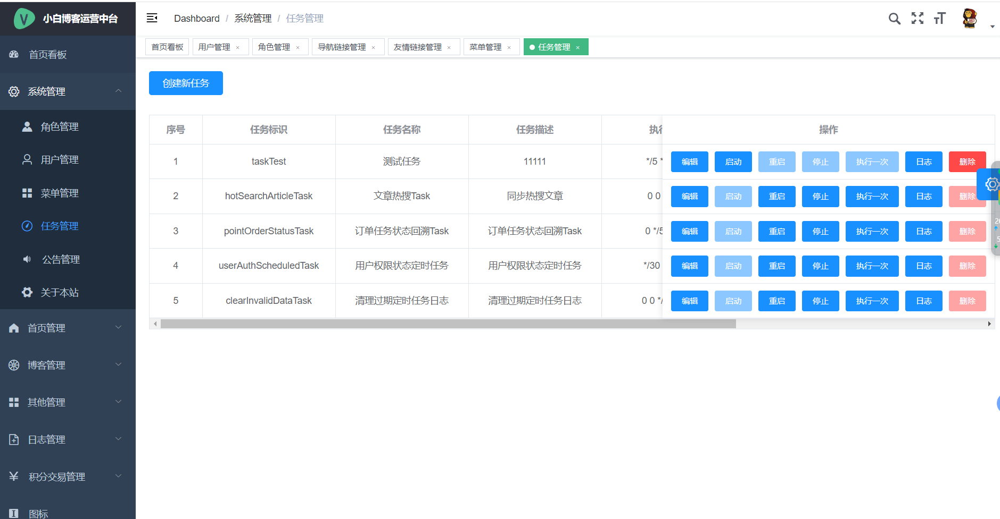
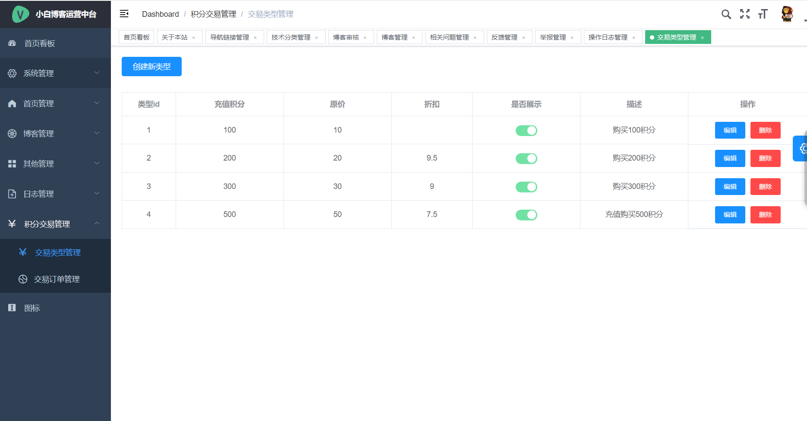

## 💡 简介

[小白博客](https://gitee.com/cxs_git_com/cxs-currency-sys-server-master) 是2022年12月份疫情期间本人居家时设计开发的一款社区博客系统，当时一心只想着开发一款自己的系统，历时3个月左右，零零散散，总算是将小白博客开发出来，虽然有些功能尚未完善，但也是小白的心血，现将此系统开源，供有需要的小伙伴交流学习。

欢迎到  了解更多。同时也欢迎关注小白微信公众号 `全栈小白`：

##  ✨ 功能

- 文章采用了比较火的Markdown编辑器。
- 系统集成了邮件发送功能。
- 系统可以自定义友情链接。
- 系统主页推荐文章 / 热门文章(展示最近n天用户访问量最多的10篇文章)。
- 集成了百度IP定位API，记录用户的登陆地址及IP归属地展示。
- 用户发布博客附带文件实现了目录文件结构的树形展示。
- 系统注册新用户实行邮箱绑定制、单个邮箱注册账号不得超过3个。
- 系统实行积分制，下载资源需要扣除相应积分，同样被下载资源的用户会得到一定积分的奖励。
- 用户可以通过每日签到获取免费积分，单日签到次数不超过1次。
- 集成了支付宝支付功能，系统已经实现了支付宝沙箱环境的对接。
- 系统尽可能实现可配置，前台信息管理端可自定义配置。
- 系统实现了对博客的点赞、收藏、评论等功能，也可对自己心仪的博主进行打赏。
- 系统实现了匿名预览功能，匿名账号拥有系统最高查看权限(除DMML操作，该账号止咳查看、无法进行增删改操作、不会对系统造成影响)
- 前后端通过token进行交互，token30分钟内持续操作无感知续时(只要用户在操作，永不过期)

##  ✨ 运行环境及技术介绍

开发工具：Idea2020.3、WebStorm2020.3

数据库：MySQL5.7、Redis

构建工具：Maven3.6.0

前端运行环境：nodejs14.21.3

- 服务端采用SpringBoot框架搭建，Mybatis—Plus做为持久层框架，SpringSecurity技术进行认证权限控制
- 数据库采用MySQL
- 前端采用了Vue2.x、Element-UI、axios、echarts等技术、管理系统采用vue-element-admin

##  ✨ 成果展示

系统视频演示：[点击查看视频演示](https://www.bilibili.com/video/BV1TC411p75U/)

系统截图简单放几个，全部放太多了

**前台系统**

前台首页

登录页

系统可以匿名访问，包括浏览文章、给博主打赏等，匿名状态下进行下载文件、点赞、评论、收藏等操作时，会自动弹出登录页面，如下图

`注意：服务端做了环境配置，开发环境验证码不做验证，随便输入即可`

文章详情页

用户点击文章列表进入文章详情页，可以进行点赞、收藏、打赏(前提是博主已开通并上传打赏收款二维码)、下载(前提是该文章附带文件资料)

举报文章

用户可对其他用户发布的文章进行举报，为防止恶意举报，单个用户每日上限举报3次

文章发布页

用户登录后可发布文章、如未编写完毕，可暂时保存草稿，下次可直接编辑

发布后由管理员审核并设置资源下载所需积分

`注意：发布成功后会有<5分钟的延迟，首页缓存，影响不大，可以通过搜索获取到文章`

个人中心->个人资料

用户可在此处查看并修改个人的用户信息

个人中心-个性化设置

用户可在此处进行积分余额是否展示、通知、博文打赏的配置(未配置不可被打赏)

管理员登录页

管理员首页

用户管理

权限：超级管理员可以设置单个用户的权限、包括用户的文件上传权限、发言评论权限、打赏功能权限、文章发布权限、申请友链权限、用户反馈权限、用户举报权限等

授权：超级管理员可对用户进行角色授权

禁用：禁止用户登陆系统

重置：充值用户登录密码

删除：删除用户

定时任务管理

配置项目中用到的一些的定时任务，也可以查看定时任务的执行日志

关于本站

管理员可设置系统的标题、Logo、系统简介等配置项

首页管理

主要配置首页的链接、标签、技术分类、导航链接等配置

博客审核

如果博客带有资料文件，可以设置下载积分，如果没有，则不能设置

举报管理

处理用户的举报，有以下几种惩罚措施

对于博客

1、举报不实、不做处理

2、删除该帖子

3、删除该帖子，禁止该用户发布文章权限

4、禁止用户上传文件权限

禁止权限可设置对应时长，单位分钟，可以设置是否邮件提醒用户

日志管理

查看管理员的操作日志

交易类型管理

配置前台用户通过购买获取积分的配置

其余功能不做演示、可查看演示视频

## ✨ 待优化项目

此系统还有一些待优化的地方

- 用户注册时会验证邮箱的正确性，个人中心修改邮箱时也可加入邮箱验证。
- 用户登录时可加入邮箱登陆的方式。
- 用户在浏览文章时，可加入博主的个人中心页面展示功能。
- ......

## ✨ 部署教程

1、拉取项目

我使用idea拉取的项目，多了.idea目录与*.iml文件

2、进入sys-client目录

分别进入两个目录，打开cmd执行如下命令，等待依赖下载完

~~~sh
npm install
~~~

3、连接数据库

依次执行config目录下的两个SQL文件，先执行init.sql，在执行cxs_currency_sys.sql

4、在sys-controller模块下找到application-dev.yml配置文件，修改以下几处地方，自行根据行号修改

1)文件上传位置配置，修改为箭头指向的全路径

2)修改数据库连接信息

3)配置邮件发送

邮箱自行申请配置，小白使用的是163邮箱

4)修改redis连接配置

5)进入百度地图开放平台申请定位AK并配置：[百度地图开放平台](https://lbsyun.baidu.com/index.php)

6)如需调试付款购买积分，自行配置支付宝沙箱环境，配置app-id、私钥、公钥

无服务器本地可使用内网穿透技术测试

7)在你的hosts文件添加一行配置

~~~sh
127.0.0.1  www.blob.com
~~~

5、启动redis服务端

6、启动服务端项目

7、启动前端项目

进入sys-client\cxs-currency-sys-client目录打开cmd，执行如下命令

~~~sh
npm run serve
~~~

进入sys-client\cxs-currency-sys-client-admin目录打开cmd，执行如下命令

~~~sh
npm run dev
~~~

前台系统访问：http://www.blob.com:3000/index

管理系统访问：http://www.blob.com:9527/

注意要使用域名访问，如使用IP或者localhost会有图片防盗链问题

前台页面

管理系统

大功告成

8、如需部署到服务器、请修改application-prod.yml配置

除7之外，修改一下日志的存储位置，可将级别修改为error

如需部署到服务器，还需要修改服务端项目的域名，申请完域名后，修改如下位置

此处域名有如下作用：

1、图片资源为服务端管理，做防盗链控制，小伙伴们可以自行使用Nginx搭建文件服务器调整

2、获取用户token顺序是先从cookie，再从header获取

## ✨ 提供账号

超级管理员：admin/123456

用户：user/1234567890!

## ✨ 交流

|                    微信(备注：加群)                    |                         公众号                         |                          QQ群                          |
| :----------------------------------------------------: | :----------------------------------------------------: | :----------------------------------------------------: |
|  |  |  |

## ✨ 赞赏

谢谢老板加的鸡腿！

|                          微信                          |                         支付宝                         |
| :----------------------------------------------------: | :----------------------------------------------------: |
|  |  |

